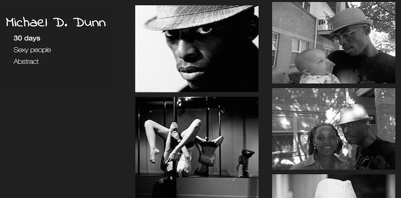

photographer-template
=====================

This is a test of a [Silex](http://www.silex.me) website for a photographer. This test uses pictures from 

[Here is the website](http://lexoyo.me/photographer-template/#!page-72157624060263403) which uses [Michael Dunn's photos](https://www.flickr.com/photos/mikedefiant) for the example.

When a page has a name which is also a [flickr](https://www.flickr.com/) album, it loads the album in the website and display the pictures in a slideshow or a galery.

Feel free to fork this repo and create your own photographer website with it.
